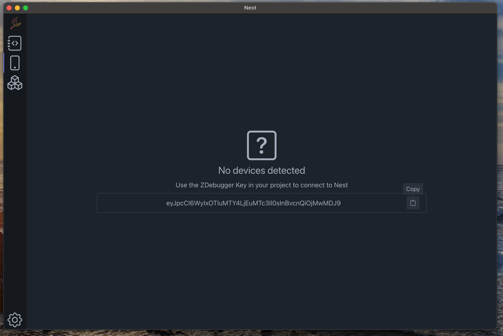

# Zernikalos Nest

## Description
Desktop application for asset management and debugging of Zernikalos Engine.

## Core Technologies
- Vue.js 3.5.13
- NestJS 11.0.9
- TypeScript 5.7.3
- Pinia 3.0.0
- Webpack 5.97.1
- Electron (with electron-forge 7.6.1)

## Prerequisites
- Node.js
- pnpm

## Installation
```bash
# Clone the repository
git clone <repository-url>

# Install dependencies recursively
pnpm i -r
```

## Running the Application

### Development Mode
```bash
# Run in development mode with hot reload
pnpm dev
```

### Production Mode
```bash
# Build the application
pnpm build

# Start the compiled application
pnpm start
```

## Project Structure

The project is organized into four main components:

### 📱 electronapp
The main Electron application that serves as the desktop application container.

### 🖥️ nestserver
A NestJS server implementation that handles internal functionalities of Zernikalos Nest. This component manages the core business logic and operations.

### 🎨 nestui
A Vue.js web application that provides the user interface for the application. Built with Vue 3 and modern web technologies.

### 🔄 store
Pinia store implementation that manages the state and communication between:
- UI components
- Electron main process
- NestJS server

## Features

### Importing 3D assets and transform into ZKO format


### Edit required field using the editor


### Link some mobile device using the debugger



## Available Scripts
- `pnpm dev`: Starts the application in development mode
- `pnpm build`: Builds the application for production
- `pnpm start`: Runs the compiled application

## License
This project is licensed under the GNU General Public License v3.0 (GPLv3) - see the [LICENSE.txt](./LICENSE.txt) file for details.

[](https://www.gnu.org/licenses/gpl-3.0)
