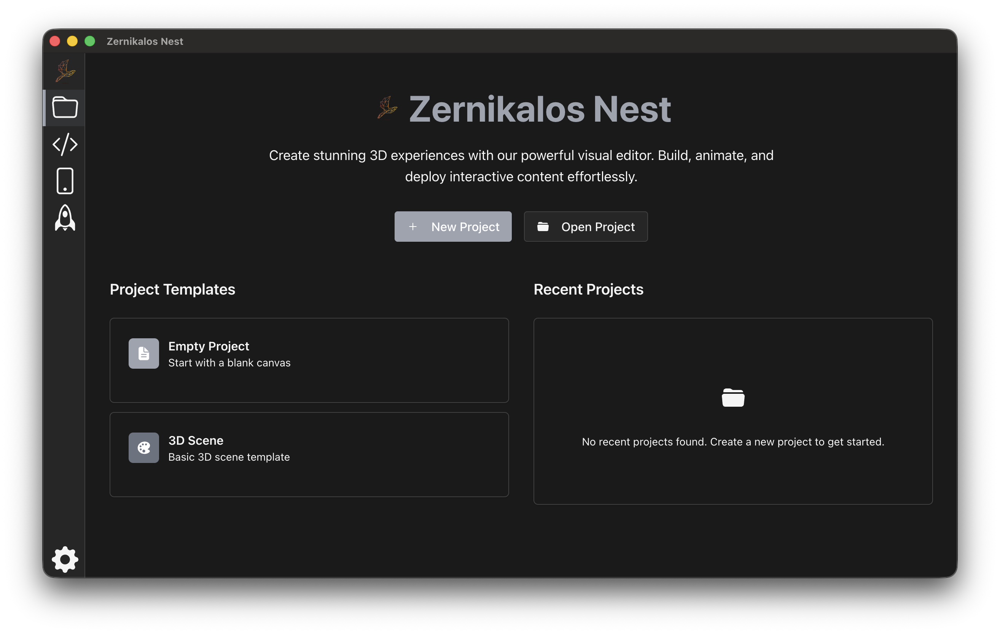
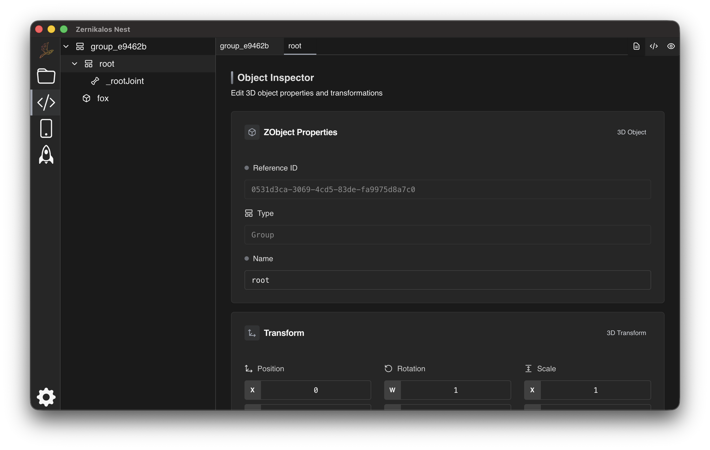
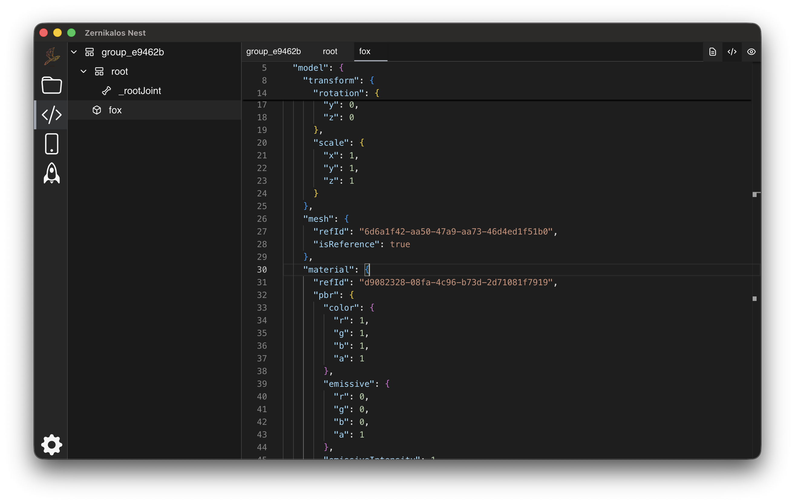
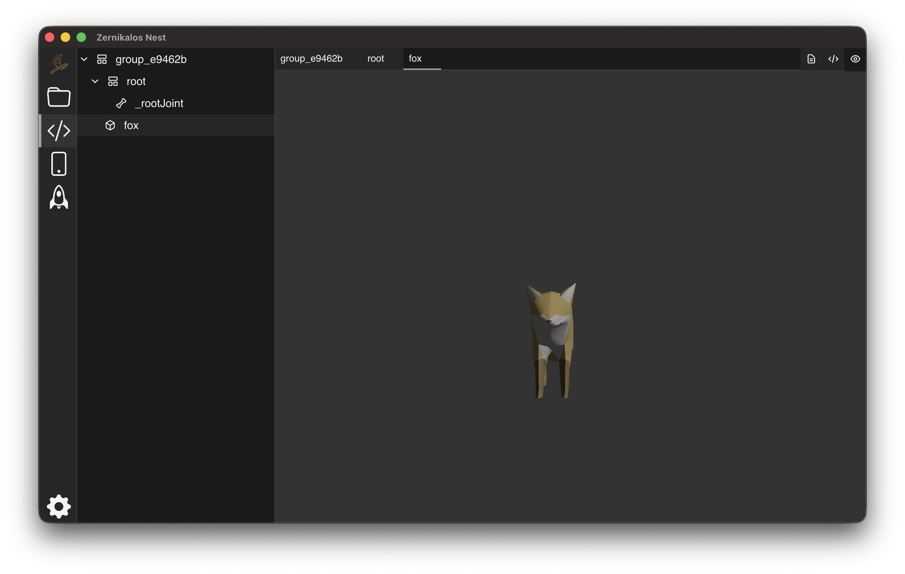
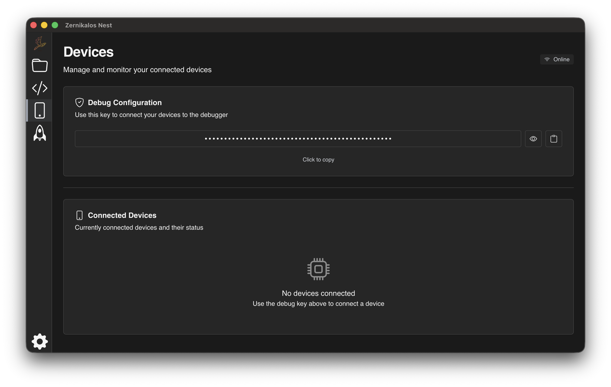
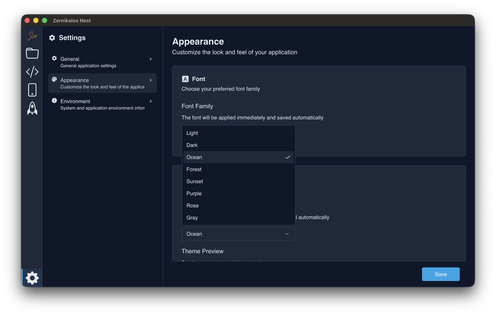

# Zernikalos Nest

## Description
Desktop application for asset management and debugging of Zernikalos Engine.

## Core Technologies
- React
- NestJS
- TypeScript
- Vite
- Tailwind CSS v4
- Zustand
- Electron (with electron-builder)

## Prerequisites
- Node.js >= 23
- pnpm >= 9

## Installation
```bash
# Clone the repository
git clone <repository-url>

# Install dependencies recursively
pnpm i -r
```

## Running the Application

### Development Mode
```bash
# Run in development mode with hot reload
pnpm dev
```

### Generating distribution package
```bash
# Build the application
pnpm build

# Generate the electron executable
pnpm dist
```

## Project Structure

The project is organized into three main components:

### 📱 electronapp
The main Electron application that serves as the desktop application container. Handles window management, native dialogs, and IPC communication.

### 🖥️ nestserver
A NestJS server implementation that handles internal functionalities of Zernikalos Nest. This component manages the core business logic, file operations, project management, and WebSocket communication for debugging.

### 🎨 reactui
A React web application that provides the user interface for the application. Built with React 19, Vite, Tailwind CSS v4, and shadcn/ui components. Manages state using Zustand (local state) and TanStack Query (server state).

## Features

### Project Management


### Asset Editor
The editor allows you to edit and configure your 3D assets with multiple views:







### Device Configuration
Link and configure external mobile devices for debugging and testing:



### Editor Settings and Themes
Customize the editor appearance and behavior:




## Available Scripts
- `pnpm dev`: Starts the application in development mode
- `pnpm build`: Builds the application for production
- `pnpm start`: Runs the compiled application

## License
This project is licensed under the Mozilla Public License 2.0 (MPL-2.0) - see the [LICENSE.txt](./LICENSE.txt) file for details.

[](https://opensource.org/licenses/MPL-2.0)
