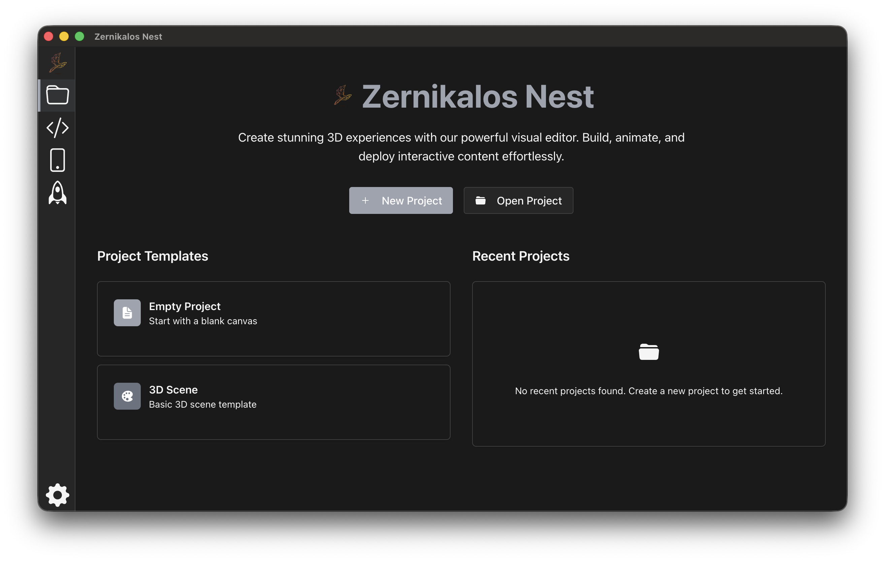
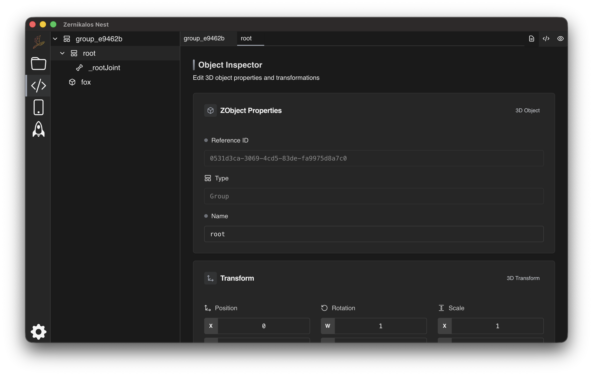
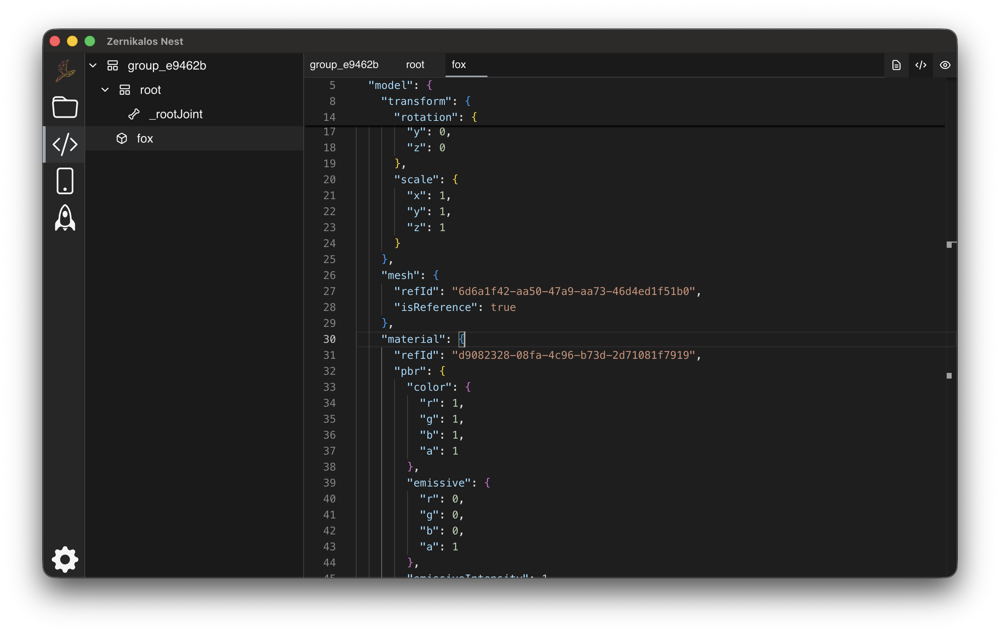
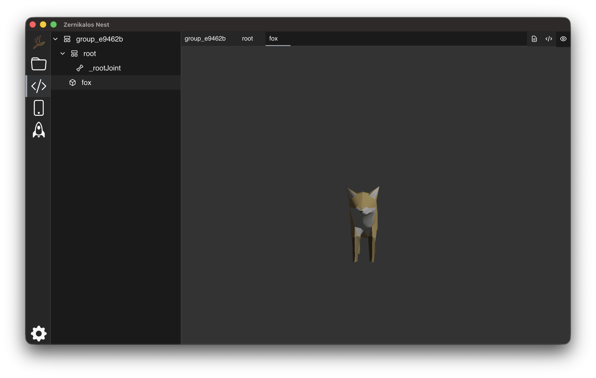
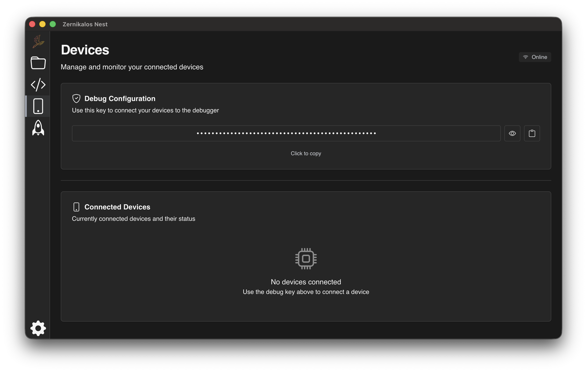
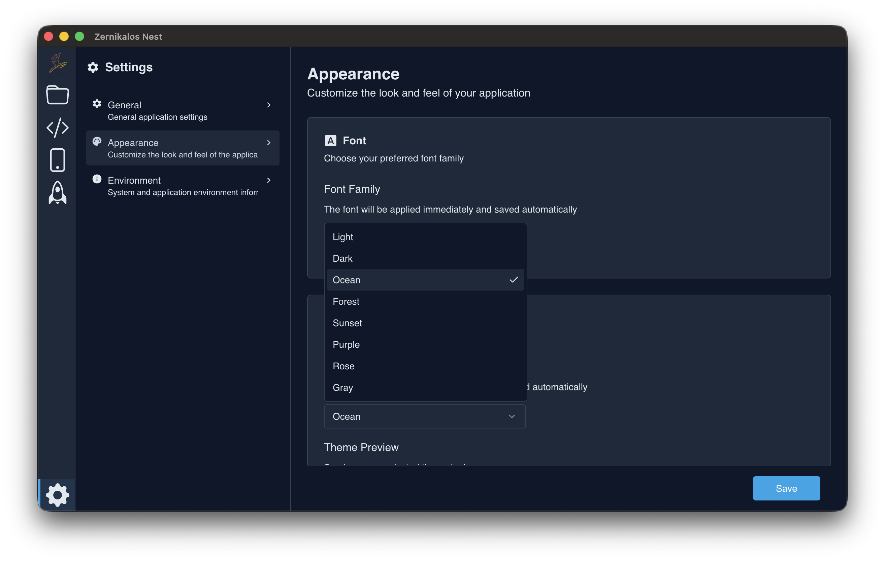

# Zernikalos Nest

## Description
Desktop application for asset management and debugging of Zernikalos Engine.

## Core Technologies
- Vue 3
- NestJS
- TypeScript
- Vite
- Tailwind CSS v4
- Pinia
- Electron (with electron-builder)

## Prerequisites
- Node.js >= 24
- pnpm >= 11
- Access to GitHub Packages for `@zernikalos/*` scopes (see below)

## Installation
```bash
# Clone the repository
git clone <repository-url>

# Install dependencies
pnpm install
```

### GitHub Packages (`@zernikalos/zernikalos`, `@zernikalos/zkbuilder`)

Private packages are hosted on GitHub Packages. Configure authentication before `pnpm install`, for example:

```bash
# .npmrc in your home directory or project root
@zernikalos:registry=https://npm.pkg.github.com
//npm.pkg.github.com/:_authToken=YOUR_GITHUB_TOKEN
```

Use a personal access token with `read:packages` scope.

## Running the Application

### Development Mode
```bash
# Run in development mode with hot reload
pnpm dev
```

### Generating a Windows distribution

Run `build` first, then package:

```bash
pnpm build
pnpm dist
```

Artifacts are written to `out/`:

| Command | Output (Windows) |
|---------|------------------|
| `pnpm dist` | NSIS installer and `.zip` (see below) |
| `pnpm pack` | `out/win-unpacked/ZernikalosNest.exe` only (unpacked folder, fastest) |

After `pnpm dist` on Windows you get:

- `out/Zernikalos Nest Setup <version>.exe` — NSIS installer (per-user install)
- `out/Zernikalos Nest-<version>-win.zip` — zip of the unpacked app
- `out/win-unpacked/` — run `ZernikalosNest.exe` directly

Other scripts: `pnpm dist:win` (force Windows targets), `pnpm dist:mac`, `pnpm dist:linux`.

Windows packages are **unsigned** by default (`signAndEditExecutable: false`) so local `pnpm dist` works without code-signing tools or symlink privileges. SmartScreen may warn on first run; use a real certificate in CI/release when you ship publicly.

## Project Structure

The project is organized into these main parts:

### 📱 electronapp
Electron main process: window management, native dialogs, and IPC.

### 🖥️ nestserver
NestJS backend: file operations, project management, settings, and WebSocket debugging.

### 🎨 vueui
Vue 3 renderer (Vite + Tailwind). Primary UI; uses `ide-core` for editor domain logic.

### 🧩 ide-core
Framework-agnostic editor runtime and contracts (`@ide-core`, `@ide-core/vue`).

## Features

### Project Management


### Asset Editor
The editor allows you to edit and configure your 3D assets with multiple views:







### Device Configuration
Link and configure external mobile devices for debugging and testing:



### Editor Settings and Themes
Customize the editor appearance and behavior:




## Available Scripts
- `pnpm dev`: Development mode (Electron + Vite + Nest server watch)
- `pnpm build`: Production build (ide-core, nestserver, vueui, electron main/preload)
- `pnpm dist`: Package for the current OS (run `pnpm build` first)
- `pnpm pack`: Unpacked app in `out/` (run `pnpm build` first)
- `pnpm clean`: Remove `node_modules`, build outputs, and `out/`

## License
This project is licensed under the Mozilla Public License 2.0 (MPL-2.0) - see the [LICENSE.txt](./LICENSE.txt) file for details.

[](https://opensource.org/licenses/MPL-2.0)
