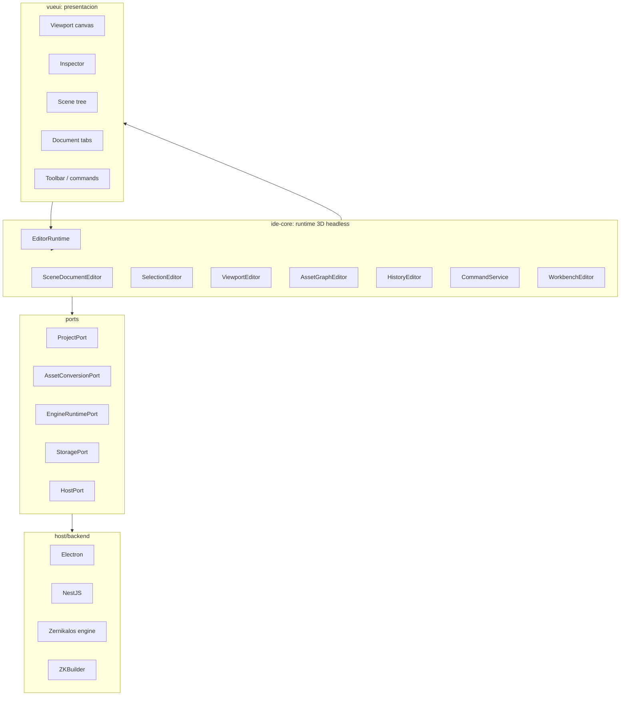
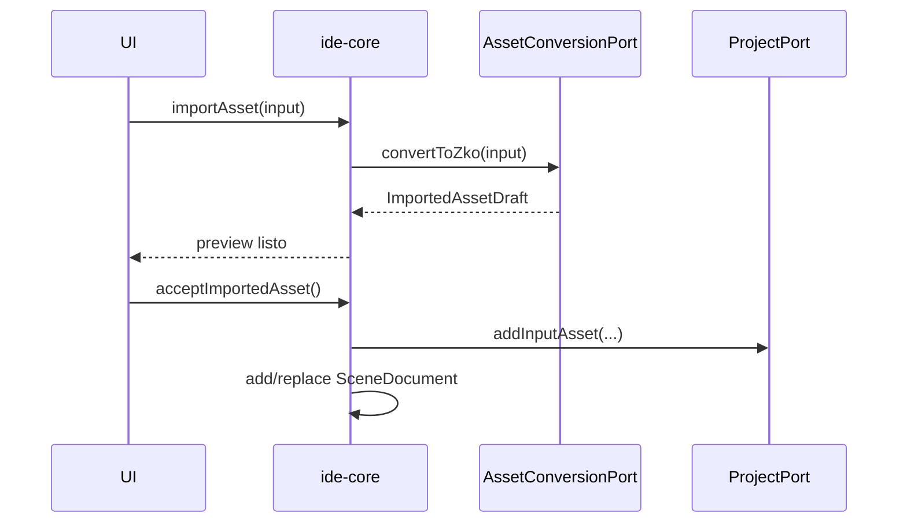
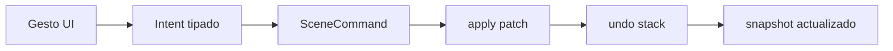
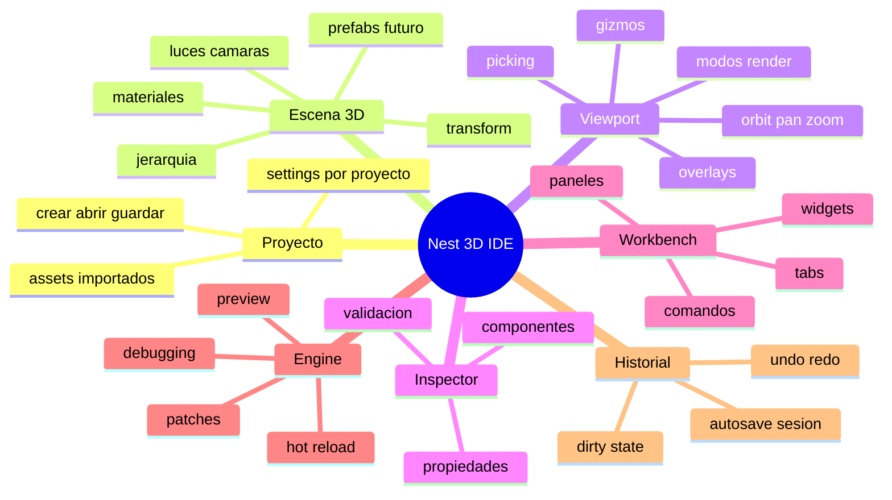

# Propuesta de simplificacion y evolucion de ide-core hacia un IDE 3D

Fecha de propuesta: 2026-07-08.

Objetivo: simplificar la arquitectura actual sin reescribir Nest, y orientar `ide-core` para que pueda sostener un IDE 3D real: escena editable, viewport, seleccion visual, inspector, assets, historial, engine runtime y extensiones.

## Diagnostico

La direccion actual es buena: `ide-core` ya concentra estado canonico de editor y Vue funciona como proyeccion. El problema principal no es el runtime general, sino que la parte 3D todavia queda demasiado repartida:

- `AssetConversionEditor` convierte assets y actualiza proyecto.
- `NestEditorProvider.vue` decide cuando rehidratar assets, extrae `zko.root`, actualiza el scene tree y provee contexto de editor.
- `useZObjectState` calcula el objeto seleccionado desde Vue.
- `useZernikalosViewer` crea la escena/camara runtime y renderiza el proto.
- `EngineSessionPort` existe, pero en la practica el engine actual es in-page y el port es no-op.

Esto funciona, pero si se anaden funcionalidades tipicas de IDE 3D (gizmo, picking, jerarquia editable, inspector avanzado, undo/redo, viewport modes, materiales, animaciones, prefabs, validacion, export pipeline), parte de la logica tendera a caer en componentes Vue.

La propuesta es mantener `ide-core` como runtime headless, pero hacer explicito un dominio 3D dentro del core.

## Principios propuestos

1. `ide-core` debe poseer intencion de editor 3D, no solo tabs y tree.
2. Vue debe renderizar y capturar gestos, pero no decidir reglas de dominio.
3. Electron/Nest/engine deben entrar por ports, no por imports.
4. La escena editable debe tener identidad estable, operaciones tipadas y snapshots serializables.
5. La migracion debe ser incremental: primero concentrar contratos y operaciones, despues mover engine/viewport.

## Arquitectura objetivo



## Cambio central: introducir `SceneDocument`

Ahora mismo hay `scene tree` y `documents`, y el contenido 3D efectivo viene de `lastResult.zko.root`. Propongo introducir un modelo explicito:

```ts
interface SceneDocument {
  uri: string;
  rootId: string | null;
  objectsById: Record<string, ZObjectNode>;
  assetRefs: AssetRef[];
  dirty: boolean;
  source?: SceneSource;
}
```

No hace falta mover todo de golpe. En la primera fase, `SceneDocumentEditor` puede ser una proyeccion normalizada del `lastResult.zko.root`. Pero la API publica deberia empezar a hablar de operaciones 3D:

| Operacion | Quien decide |
| --- | --- |
| seleccionar objeto(s) | `SelectionEditor` |
| renombrar objeto | `SceneDocumentEditor` |
| cambiar transform | `SceneDocumentEditor` + `HistoryEditor` |
| cambiar material | `SceneDocumentEditor` |
| abrir documento de objeto | `DocumentsEditor` coordinado desde core |
| actualizar viewer | `ViewportEditor` / `EngineRuntimePort` |

Esto evita que componentes Vue tengan que recorrer el root y aplicar reglas por su cuenta.

## Separar importacion, conversion y persistencia

`AssetConversionEditor.convert()` convierte y luego intenta guardar el asset en proyecto. Para un IDE 3D conviene separar tres comandos:



Ventajas:

- Permite preview antes de persistir.
- Permite cancelar importaciones.
- Permite batch import.
- Permite reemplazar o fusionar escena sin acoplar conversion a proyecto.
- Evita warnings tardios mezclados con el estado de conversion.

## Unificar contrato de host fuera de Vue

Hoy `HostPort` se exporta desde `@ide-core/vue`. Eso es comodo, pero conceptualmente no pertenece a Vue. Dos opciones:

| Opcion | Descripcion | Recomendacion |
| --- | --- | --- |
| `@ide-core/host` | Nueva entrada para `HostPort`, dialogos, plataforma, menu context y window chrome. | Mejor si se espera otro renderer o tests de host. |
| `@ide-core` | Exportar `HostPort` desde common junto a `HostDialogsPort`. | Mas simple si no se quiere nueva entrada. |

Recomendacion: empezar exportandolo desde `@ide-core` y dejar `@ide-core/vue` como re-export temporal para no romper imports.

## Hacer real el engine port

El estado actual tiene `EngineEditor`, pero el adapter es no-op. Para un IDE 3D, el runtime deberia tener un `EngineRuntimePort` mas expresivo:

```ts
interface EngineRuntimePort {
  createSession(input: EngineSessionInput): Promise<EngineSessionHandle>;
  disposeSession(id: string): Promise<void>;
  loadScene(id: string, scene: EngineScenePayload): Promise<void>;
  applyPatch(id: string, patch: ScenePatch): Promise<void>;
  setViewport(id: string, viewport: ViewportState): Promise<void>;
  pick(id: string, point: { x: number; y: number }): Promise<PickResult | null>;
}
```

El viewer Vue seguiria siendo el canvas y el loop visual, pero las decisiones de lifecycle y sincronizacion vivirian en core. En fase inicial, el port puede envolver el engine in-page actual.

## Introducir `ViewportEditor`

Para IDE 3D hacen falta estados de viewport persistibles y testeables:

| Estado | Ejemplos |
| --- | --- |
| Camara | posicion, target, projection, clipping. |
| Herramienta activa | select, move, rotate, scale, pan/orbit. |
| Overlays | grid, axes, bounds, lights, cameras, skeletons. |
| Modo de render | shaded, wireframe, material preview, normals. |
| Picking | hovered object, selected face/edge/vertex futuro. |

`useZernikalosViewer` deberia convertirse gradualmente en un adapter visual que:

1. Lee `viewport` y `sceneDocument` desde slices.
2. Emite eventos: `viewport.pointerDown`, `viewport.pick`, `viewport.cameraChanged`.
3. Delega cambios a `runtime.viewport` y `runtime.selection`.

## Introducir historial de comandos

Para un IDE 3D, undo/redo no deberia ser un detalle de componentes. Propongo un `HistoryEditor` con command objects o patches:



Primeros comandos:

- `RenameObjectCommand`
- `SetTransformCommand`
- `SetMaterialCommand`
- `AddObjectCommand`
- `RemoveObjectCommand`
- `ReparentObjectCommand`
- `ImportAssetCommand`

Esto tambien ayuda a serializar cambios hacia el engine con `ScenePatch`.

## Propuesta de slices futuras

| Slice | Responsabilidad |
| --- | --- |
| `scene` | Jerarquia visible y seleccion derivada para el tree. |
| `documents` | Documentos abiertos y activo. |
| `sceneDocument` | Documento 3D editable normalizado. |
| `selection` | Seleccion multiobjeto, hover y focus semantico. |
| `viewport` | Camara, herramienta activa, overlays y picking state. |
| `assets` | Assets importados, drafts, conversiones y referencias. |
| `project` | Proyecto abierto y metadata. |
| `engine` | Sesiones reales y estado de sincronizacion. |
| `history` | Undo/redo y dirty state. |
| `workbench` | Layout/widgets. |

No hace falta anadir todas a la vez. La prioridad es `sceneDocument`, `selection` y `viewport`.

## Plan incremental

### Fase 1: limpiar contratos sin cambiar UI

- Exportar `HostPort` desde una entrada no-Vue o desde `@ide-core`.
- Documentar `@ide-core/browser` como historico o eliminar menciones si no vuelve.
- Separar tipos de importacion/conversion/persistencia aunque el flujo siga igual.
- Mover helpers de seleccion de ZObject desde Vue hacia `ide-core` si son dominio.

Resultado: menos ambiguedad y mejor frontera core/UI.

### Fase 2: crear dominio 3D minimo en core

- Introducir `SceneDocumentEditor` como wrapper normalizado del `zko.root`.
- Introducir `SelectionEditor` para objeto activo, multi-seleccion y hover.
- Hacer que `SceneTreeEditor` derive su arbol desde `SceneDocumentEditor` cuando haya documento 3D.
- Mantener compatibilidad con `setTreeFromRoot` durante la migracion.

Resultado: el 3D empieza a tener modelo propio en core.

### Fase 3: viewport controlado por runtime

- Crear `ViewportEditor`.
- Convertir `useZernikalosViewer` en adapter visual.
- Definir eventos de viewport/picking como intents hacia runtime.
- Persistir camara/herramienta/overlays en sesion.

Resultado: viewport e inspector pueden compartir el mismo estado.

### Fase 4: engine runtime port real

- Reemplazar el `EngineSessionPort` no-op por un adapter real, aunque envuelva el engine in-page.
- Definir carga de escena y aplicacion de patches.
- Exponer estado de sincronizacion: clean, syncing, stale, failed.

Resultado: el editor puede crecer hacia preview, simulacion, remote debugging o procesos separados sin reescribir UI.

### Fase 5: historial y comandos 3D

- Introducir `HistoryEditor`.
- Reimplementar transform/rename/material como comandos undoables.
- Conectar dirty state de documentos al historial.
- Enviar patches al engine desde el mismo pipeline.

Resultado: comportamiento de IDE profesional y testeable.

## Arquitectura propuesta en repositorio

```text
ide-core/src/common/
  editor/
    sceneDocument.ts
    selection.ts
    viewport.ts
    history.ts
    assets.ts
  engine/
    scenePatch.ts
    engineRuntimePort.ts
  host/
    hostPort.ts
  runtime/
    EditorRuntime.ts
    EditorOrchestrator.ts
    ViewportCoordinator.ts
    EngineSyncCoordinator.ts
vueui/src/
  components/ZernikalosViewer/
    ZernikalosViewportAdapter.vue
  runtime/
    engineRuntimeAdapter.ts
    assetConversionAdapter.ts
electronapp/src/
  host/
    engineHost.ts
nestserver/src/
  projects/
  assets/
  debugger/
```

## Diagrama funcional objetivo



## Decisiones concretas recomendadas

1. Mantener `ide-core` como package unico por ahora. No crear monorepo nuevo ni extraer muchos paquetes antes de tener el dominio 3D claro.
2. Crear primero editores pequenos (`SceneDocumentEditor`, `SelectionEditor`, `ViewportEditor`) antes que una DI completa.
3. No meter Vue components ni tipos DOM en `ide-core`.
4. Mantener ports simples, pero hacerlos semanticamente reales: `EngineRuntimePort` debe hablar de escena, viewport, patches y picking.
5. Usar snapshots serializables para UI; usar handles solo dentro de adapters/ports.
6. Migrar `NestEditorProvider` reduciendo responsabilidades, no eliminandolo de golpe.

## Resultado esperado

Con estos cambios, Nest pasaria de ser una UI con viewer 3D y runtime de editor general a un IDE 3D con nucleo de dominio propio:

- El arbol, las tabs, el inspector y el viewport leerian la misma escena editable.
- Los gestos de viewport se convertirian en operaciones de dominio testeables.
- El engine seria un adapter reemplazable, no una decision escondida en un composable.
- La importacion de assets tendria preview, aceptacion/cancelacion y persistencia limpia.
- Undo/redo y dirty state podrian cubrir operaciones 3D reales.

La clave es no romper lo que ya funciona: el modelo actual de runtime, slices, ports y adapters es una buena base. La mejora es hacer que el 3D sea ciudadano de primera clase dentro de `ide-core`.
