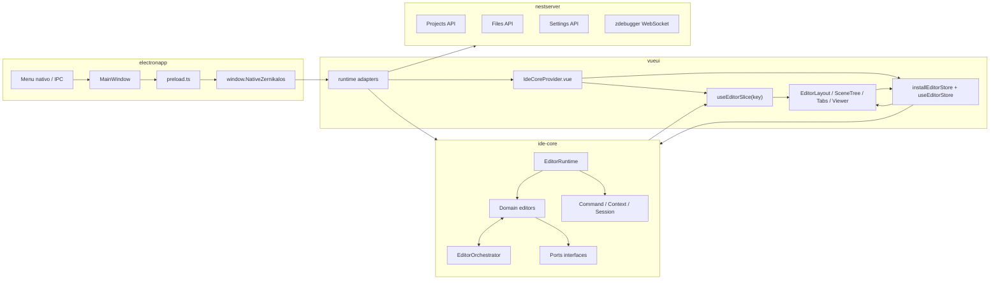
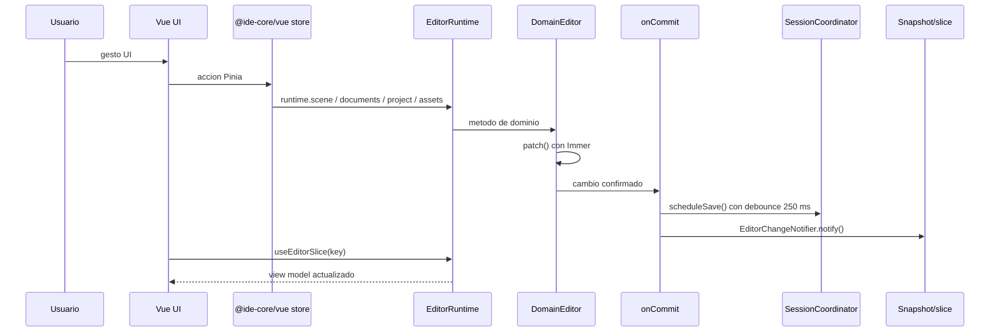
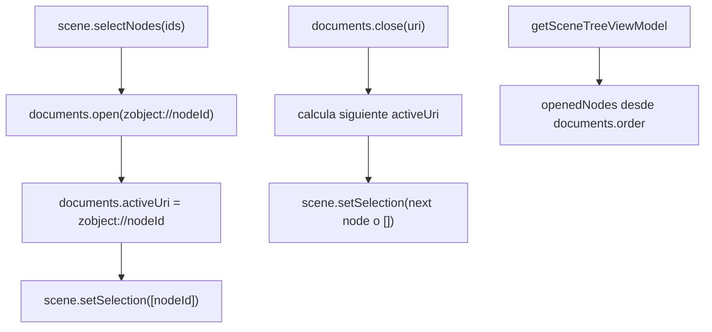
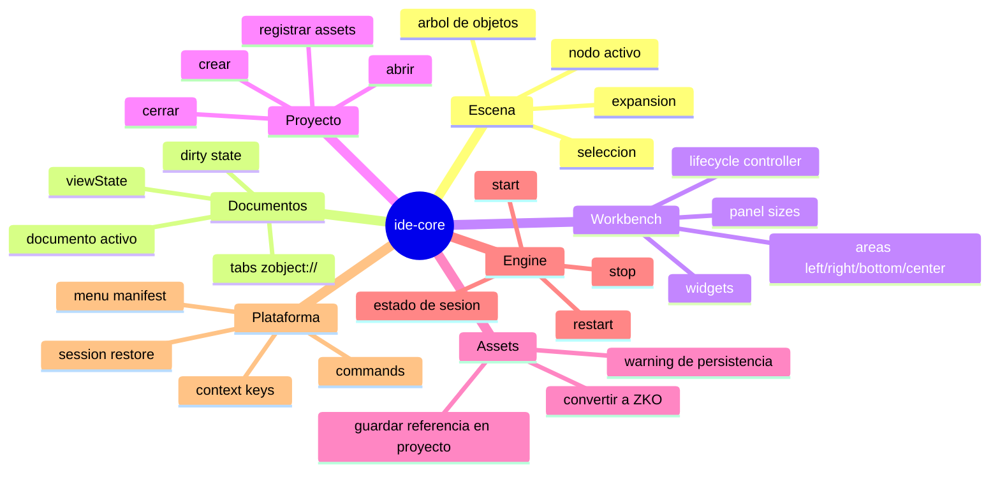

# ide-core: arquitectura actual

Fecha de revision: 2026-07-08.

Este documento describe como funciona `ide-core` ahora mismo en Nest. La documentacion historica relevante vive en `wiki/ide-core/` y `wiki/proposals/`, pero este texto esta contrastado con el codigo actual de `ide-core/src`, `vueui/src`, `electronapp/src` y `nestserver/src`.

## Resumen corto

`ide-core` es el runtime headless del editor de Nest. No renderiza UI, no conoce Vue, no usa Electron directamente y no accede al DOM. Su trabajo es mantener el estado canonico del editor y exponer operaciones de dominio: escena, documentos/tabs, workbench, proyecto, sesion de engine, conversion de assets, comandos, contexto y persistencia de sesion.

La UI de Vue consume `ide-core` mediante `@ide-core/vue`, que instala un store Pinia de acciones y expone slices reactivos del snapshot. Electron y NestJS quedan fuera del core: Electron aporta dialogos, menu nativo, IPC, storage y ventana; NestJS aporta APIs HTTP/WebSocket para proyectos, archivos, settings y debugging.

## Entradas publicas actuales

| Entrada | Rol |
| --- | --- |
| `@ide-core` | Runtime framework-agnostic: `createEditorRuntime`, editores de dominio, ports, tipos, comandos, menus y contratos. |
| `@ide-core/vue` | Adaptador Vue/Pinia: `provideEditorRuntime`, `installEditorStore`, `useEditorStore`, `useEditorSlice`, `HostPort`. |
| `@ide-core/electron` | Contratos de IPC/host para Electron: canales, menu context, preload bridge de dialogos. |

Nota: algunas docs antiguas mencionan `@ide-core/browser`. En el codigo actual revisado, el `HostPort` del renderer se exporta desde `@ide-core/vue`.

## Diagrama de alto nivel

## Composicion del runtime

`createEditorRuntime(ports?)` crea una instancia de `EditorRuntimeImpl`. El runtime recibe ports opcionales:

| Port | Implementacion actual |
| --- | --- |
| `StoragePort` | En Vue se elige entre storage de Electron (`window.NativeZernikalos.storage*`) y `localStorage`. |
| `ProjectPort` | `vueui/src/runtime/projectAdapter.ts`, delega a la API HTTP de proyectos de `nestserver`. |
| `AssetConversionPort` | `vueui/src/runtime/assetConversionAdapter.ts`, usa `@zernikalos/zkbuilder` y la API de archivos. |
| `EngineSessionPort` | `vueui/src/runtime/engineSessionAdapter.ts`, actualmente es no-op porque el viewer corre in-page. |

Dentro del runtime se crean:

| Subsystem | Archivo principal | Responsabilidad |
| --- | --- | --- |
| Scene tree | `ide-core/src/common/editor/sceneTree.ts` | Arbol de objetos, seleccion, expansion, nodo activo, nodo enfocado. |
| Documents | `ide-core/src/common/editor/documents.ts` | Tabs/documentos abiertos por URI, documento activo, dirty state y view state. |
| Workbench | `ide-core/src/common/editor/workbench.ts` | Areas, widgets, panel sizes, lifecycle de widgets. |
| Project | `ide-core/src/common/editor/project.ts` | Path/proyecto abierto, carga, creacion y alta de assets mediante `ProjectPort`. |
| Engine | `ide-core/src/common/editor/engine.ts` | Estado idle/starting/running/stopping/failed mediante `EngineSessionPort`. |
| Assets | `ide-core/src/common/editor/assetConversion.ts` | Conversion a ZKO, resultado, errores y persistencia del asset en proyecto. |
| Commands | `ide-core/src/common/services/CommandService.ts` | Registro y ejecucion de comandos, incluidos los usados por menu. |
| Context keys | `ide-core/src/common/services/ContextKeyService.ts` | Flags evaluables como `projectOpen` para menus y activaciones. |
| Session | `ide-core/src/common/runtime/SessionCoordinator.ts` | Persistencia/hidratacion de escena, workbench y documentos. |

Todos los editores de dominio extienden `DomainEditorBase`, basado en Zustand vanilla e Immer. Las mutaciones normales usan `patch()`, que dispara commit. Las mutaciones de sincronizacion/hidratacion usan `patchSilent()` para evitar commits intermedios.

## Pipeline de escritura y lectura

El snapshot agregado tiene estas slices:

| Slice | Contenido |
| --- | --- |
| `scene` | Arbol, seleccion, nodo activo, nodos abiertos derivados de documentos, expansion y foco. |
| `documents` | `activeUri` y lista ordenada de documentos abiertos. |
| `workbench` | Areas, widgets abiertos, widget activo y tamanos de panel. |
| `project` | Path, metadata de proyecto, loading/error e `isProjectOpen`. |
| `engine` | Estado de sesion de engine e indicadores derivados `isRunning`/`isBusy`. |
| `assets` | Estado de conversion, ultimo resultado, errores y warnings de persistencia. |

`subscribeSlice('scene')` escucha tanto escena como documentos, porque `openedNodes` y `activeNode` se proyectan combinando ambos estados.

## Sincronizacion escena-documentos

`EditorOrchestrator` es el punto unico de reglas entre scene tree y documentos:

La consecuencia practica es que el arbol y las tabs no son dos fuentes de verdad separadas. Los documentos son la fuente de verdad de tabs abiertas; la escena aporta jerarquia y seleccion.

## Funcionalidades actuales cubiertas por ide-core

## Integracion con Vue

`vueui/src/components/IdeCoreProvider.vue` crea una sola instancia de runtime:

1. Decide el storage: Electron si existe, `localStorage` en caso contrario.
2. Crea `ProjectPort`, `AssetConversionPort` y `EngineSessionPort`.
3. Llama a `createEditorRuntime({ storage, project, assetConversion, engineSession })`.
4. Publica el runtime con `provideEditorRuntime`.
5. Instala el store Pinia con `installEditorStore`.

La UI deberia escribir mediante `useEditorStore()` y leer mediante `useEditorSlice(key)`.

`NestEditorProvider.vue` contiene hoy parte importante del flujo 3D:

1. Si hay proyecto abierto y no hay `lastResult`, rehidrata convirtiendo el asset mas reciente.
2. Cuando existe `lastResult.zko.root`, llama a `editor.setTreeFromRoot(root)`.
3. Provee contexto para el editor: tree, selectedIds, openedNodes, activeNode, selectedZObject, `zkResult`, `notifyChange`.
4. El viewer usa `lastResult.proto` como `sceneData`.

## Integracion con Electron

Electron no entra en `ide-core` directamente. La capa actual es:

| Pieza | Rol |
| --- | --- |
| `electronapp/src/preload.ts` | Expone `window.NativeZernikalos` con dialogos, storage, settings, menu context y controles de ventana. |
| `@ide-core/electron` | Define canales/contratos compartidos sin importar `electron`. |
| `vueui/src/adapters/createElectronHostPort.ts` | Traduce `window.NativeZernikalos` al `HostPort` usado por el renderer. |
| `electronapp/src/MainWindow.ts` | Crea ventana, registra IPC, reacciona al `MenuContext` y monta menu nativo en macOS. |

El menu de aplicacion vive en `ide-core/src/common/menu/appMenuManifest.ts`; se resuelve con context keys como `projectOpen`. En macOS se adapta a menu nativo; en Windows/Linux se usa menu in-renderer.

## Integracion con NestJS

`nestserver` es el backend local:

| Modulo | Funcion |
| --- | --- |
| `projects` | Crea/lee `.zkproj` y persiste assets importados. |
| `files` | Expone paths locales mediante un id CRC32 para que `zkbuilder` pueda cargar archivos. |
| `settings` | Persistencia de preferencias de app. |
| `zdebugger` + `bridge` | WebSocket para mensajes de logs/stats/debugger entre Nest y dispositivos/clientes. |

El core no llama HTTP directamente. La UI implementa ports que delegan a `vueui/src/lib/*Api.ts`, y esos clientes hablan con `nestserver`.

## Estado actual del 3D

Nest ya tiene piezas de IDE 3D, pero no todas viven en `ide-core`:

| Aspecto 3D | Ubicacion actual |
| --- | --- |
| Conversion de assets a ZKO/proto | `AssetConversionEditor` en core + adapter de Vue con `zkbuilder`. |
| Arbol de objetos 3D | `SceneTreeEditor` en core, alimentado desde `lastResult.zko.root`. |
| Seleccion de objetos | Core sincroniza seleccion y tabs; Vue calcula `selectedZObject` sobre el root actual. |
| Viewer canvas | `vueui/src/components/ZernikalosViewer` y `useZernikalosViewer`. |
| Camera/scene runtime del viewer | En composable Vue, creando `Zernikalos`, `ZScene` y `ZCamera` in-page. |
| Engine session | Port existente en core, pero adapter actual no-op. |

La conclusion es que `ide-core` ya ordena el editor, pero la semantica 3D avanzada todavia esta repartida entre core y Vue. Esto es normal para el estado actual, pero es el principal punto a mejorar si el producto final debe ser un IDE 3D.

## Riesgos o zonas a vigilar

| Riesgo | Impacto |
| --- | --- |
| Flujo 3D repartido entre `AssetConversionEditor`, `NestEditorProvider`, `useZObjectState` y `useZernikalosViewer`. | Dificulta testear operaciones 3D sin UI y puede crear duplicacion al anadir gizmos, inspector, picking o historial. |
| `EngineSessionPort` existe, pero es no-op. | El runtime aparenta tener lifecycle de engine, aunque el viewer real esta acoplado al renderer. |
| HostPort vive en `@ide-core/vue`. | Mezcla contrato de host renderer con adaptador Vue; si aparece otro renderer habra que mover o duplicar. |
| Documentacion historica con React/Zustand/browser entry. | Puede confundir implementaciones nuevas si no se contrasta con el codigo actual. |
| `AssetConversionEditor.convert()` tambien registra el asset en el proyecto. | Une conversion y persistencia; practico ahora, pero menos flexible para flujos de import preview, cancelacion o batch. |

## Referencias de codigo

- `ide-core/src/common/runtime/EditorRuntime.ts`
- `ide-core/src/common/runtime/createEditorRuntime.ts`
- `ide-core/src/common/runtime/EditorOrchestrator.ts`
- `ide-core/src/common/runtime/SessionCoordinator.ts`
- `ide-core/src/common/editor/`
- `ide-core/src/vue/`
- `ide-core/src/electron/`
- `vueui/src/components/IdeCoreProvider.vue`
- `vueui/src/components/editor/NestEditorProvider.vue`
- `vueui/src/composables/useZernikalosViewer.ts`
- `electronapp/src/preload.ts`
- `electronapp/src/MainWindow.ts`
- `nestserver/src/projects/projects.service.ts`
